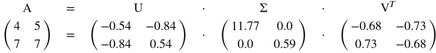
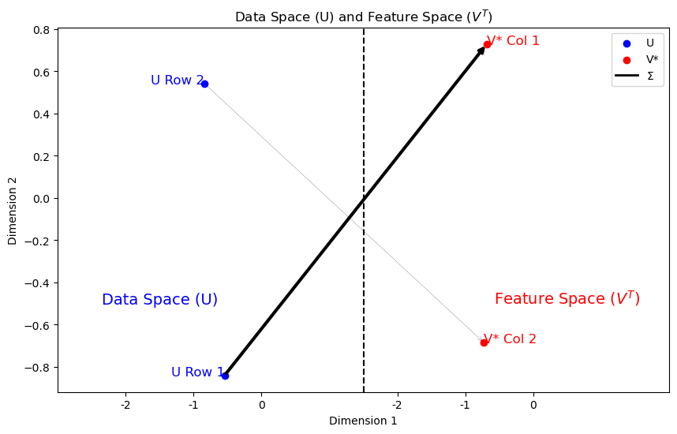

# Singular Value Decomposition (SVD)

<div align="center">
  
</div>

<div align="center">
  
</div>


This figure illustrates the relationship between the Data Space (U) and Feature Space ($V^T$) derived from the Singular Value Decomposition (SVD) of matrix A.

This repository provides an implementation and exploration of Singular Value Decomposition (SVD) in Python, specifically within a Jupyter Notebook. SVD is a powerful matrix factorization technique used in numerous applications such as data reduction, noise filtering, and latent semantic analysis.

## Overview

Singular Value Decomposition (SVD) decomposes a matrix `A` into three matrices:

$$
A = U \Sigma V^T
$$

- `U` is an orthogonal matrix containing the left singular vectors.
- `\Sigma` is a diagonal matrix with singular values.
- `V^T` is the transpose of an orthogonal matrix containing the right singular vectors.

## Features

- Detailed exploration of SVD using Python in a Jupyter Notebook.
- Step-by-step examples and visualizations for understanding the decomposition results.
- Explanation of how SVD can be applied to real-world data.

## Installation

To get started, clone this repository and install the required dependencies:

```bash
git clone https://github.com/galenwilkerson/singular-value-decomposition-SVD.git
cd singular-value-decomposition-SVD
pip install -r requirements.txt
```

## Usage

To explore SVD in depth:

1. Open the Jupyter Notebook `Singular Value Decomposition (SVD) Tutorial.ipynb`.
2. Follow along with the explanations, run the code cells, and observe the visualizations to gain a deeper understanding of SVD.

## Contributing

Contributions are encouraged! To contribute:

1. Fork the repository.
2. Create a feature branch.
3. Commit your changes and push them to your fork.
4. Open a pull request to merge your changes.

## License

This project is licensed under the MIT License. See the [LICENSE](LICENSE) file for details.
